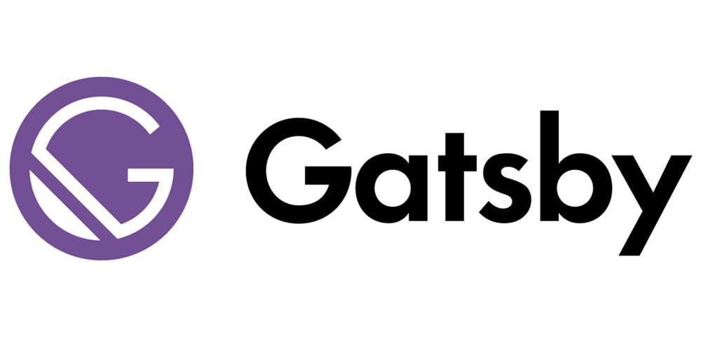

> 블로그를 커스텀해보고 싶어서 
> 만들어본 Gatsby블로그 

Gatsby블로그를 만들고 처음으로 써보는 포스트는 왜 다른 플랫폼(Tistory, Medium 등)을 쓰지 않고
`Gatsby`를 선택했는지 포스팅 하는 것이 좋겠다. 라는 생각이 들어 첫 포스팅으로는 Gatsby를 선택한 이유에 대해서 다루려고 한다.

먼저 나는 기존에는 Tistory블로그를 사용중이 었다. 취업준비용 블로그 한개와 대학생시절 재미로 해본 블로그가 두개가 있는데

 

- [초보개발자 갓준] (https://godjaejun.tistory.com/)
- [DevRappers의 IT 블로그] (https://devrappers.tistory.com/)

 

TMI지만 사실 애정을 가진 블로그는 초보개발자 갓준때 했던 블로그 였던 것 같다. 올해 초 입사한 회사에서도
취업준비용 블로그였던 DevRappers의 IT블로그가 아닌 초보개발자 갓준이라는 블로그를 보시고 나를 채용했다고 한다.

메인주제로 Gatsby를 선택한 3가지 이유에 대해서 말해보려 한다.
  

## 1. Front-end 개발자라면 블로그도 직접 만들어봐야 하는 것 아닐까?

사실 이러한 점이 가장 컸던 것 같다. Tistory같은 블로그도 블로그 스킨을 수정하여 자기 입맛에 맞게 수정이 가능하지만,
제약도 많이 존재하고 내가 블로그를 만든다는 기분이 들지 않아 재미를 느끼지 못했던 것 같다.

그리고 현재 회사에서 React개발자로 일을 하고 있는데 React를 활용하여 블로그를 만들고 싶었기 때문에 Gatsby를 선택하게 된 것 같다.

또 지금 Tistory는 바뀌어서 괜찮지만 예전에는 구글에 검색을 노출 시키기 위해선 Sitemap도 등록 시키고 별짓을 다하는데 Gatsby를 통해서 블로그를 만들고 
지금 사용하고 있는 템플릿인 `Gatsby-starter-bee` 를 사용했을 때에는 따로 귀찮은 작업없이 사용가능한게 좋은 것 같다.

Gatsby에 대한 설명은 다른 블로거들이 많이 다룬 내용이기 때문에 다루지 않겠다. 

 

## 2. 글작성 에디터가 너무 보기 싫어요. 😂

이 이유도 큰 것 같다. 사실 마크다운을 그렇게 잘 사용하는 편은 아지만 Tistroy에디터를 사용했을 때 평가는 글씨 크기 하나 조정할 때 드래그하고 크기 키우고 이런게 너무 지겨워서
마크다운이 쓰고 싶어졌던 것 같다.

이러한 이유로 원래는 Velog라는 플랫폼을 이용해 블로그를 운영할까 고민도 많이 했지만 그냥 독립적으로 블로그를 만들고 싶었고, 나중에 돈은 안되겠지만 에드센스도 달고 싶어서 게츠비를 선택하게 됬다. 

 

## 3. 블로그를 장기적으로 운영하고 싶어요. 😎

이 말은 사실 핑계에 가깝지만 내가 게츠비로 블로그를 만들고 커스텀해서 운영한다면 더욱 블로그에 애정을 가질 수 있지 않을까 해서 라는 이유이다. 

Tistory블로그 운영당시 매일 글 하나를 올리려고 노력하고, 많이 했지만 계속 올리면서 애정도 떨어지고 이로 인해 글의 퀄리티도 많이 떨어지는 것 같기 때문에 게츠비 블로그를 선택하게 된 것 같다.

 

### 마무리 🚀 
이상 Gatsby를 선택한 이유를 마무리하고, 짧게 나마 블로그를 만들때 참조했던 블로그와 또 앞으로 어떤식으로 블로그를 운영할지 적어보려고 한다.

참조했던 사이트 : [jbee님의 블로그](https://jbee.io/etc/intro-new-blog/)

사실 jbee님이 만드신 `gatsby-stater-bee` 라는 template을 이용했기 때문에 빠르게 만들 수 있었던 것 같다. gatsby블로그를 고려하는 분들이라면 참고하면 매우 큰 도움이 될 것 같다.

마지막으로 이 블로그는 이제부터 하루에 1포스트는 힘들겠지만 1주일 포스트라도 올리려고 마음먹고 있으며, 개발 동아리 회장으로서의 이야기와 2년차 프론트엔드 개발자가 회사에서 겪는 기술적인 문제와 더불어 
새로운 기술에 대해 학습하는 내용을 정리하는 것으로 사용해보려고 한다.

_DevRappers_ 많이 관심가져주시면 좋겠습니다. 감사합니다.⚡️

