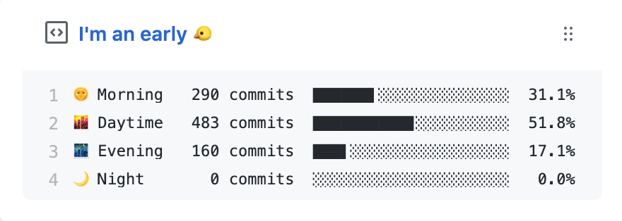
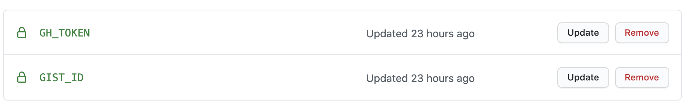
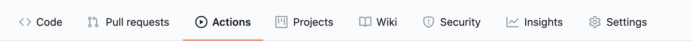

> 나의 Daily 코딩습관을 알아볼 수 있는 I'm an early 만들어보기

 
얼마전 다른사람들의 Github를 구경하던 도중 I'm an early라는 것을 발견하게 되었다.

처음에는 그냥 리드미를 재미있게 적은 것인가 생각을 했지만 다시 보니 커밋을 어떤 시간에 하는지 보여주는 거였다.

그래서 이런것을 알아보면서 포스팅해보게 되었다.

## 직접 적용하기 🤭

- 오픈소스 Repository를 `Fork`
  - [productive-box]("https://github.com/maxam2017/productive-box") 를 내 저장소로 Fork함.

 

- Github에 들어가서 Public Gist를 생성하기.
  - [Gtihub Gist]("https://gist.github.com/") 에 들어가서 아무거나 적고 public gist로 생성해주면 된다.

 

- Github 토큰을 생성해준다.
  - [토큰 생성]("https://github.com/settings/tokens/new") 에 들어가서 repo와 gist를 선택하고 토큰 Note를 입력하고 생성해주면된다.
  - 생성된 토큰을 복사해둔다.

 

- 새로 생성한 Gist의 URL 주소의 사용자 뒷부분을 복사해준다. username/? <- ?부분 복사.

 

- Secrets 등록하기

  - Fork 해두었던 저장소로 들어가서 Setting에 Secrets 탭으로 들어간다.
  - Secrets을 생성해준다.
  - GH_TOKEN : 아까 생성한 깃허브 토큰을 넣으면 된다.
  - GIST_ID : Gist의 URL 주소의 사용자 뒷부분을 넣어주면 된다.
    

 
  
마지막 작업으로 Action을 Enable(활성화)시켜준다.

 

이 작업이 모두 끝났으면 Github 내 프로필에서 pinned에서 방금 만든 gist를 설정해주면 된다.

그럼 프로필에서 I'm an early 를 볼 수 있다.

### 마무리 🚀

결과물을 보니 나는 절대 새벽에는 코딩을 안하는 것 같다..😂 깨어있을때라도 더 열심히 해야겠다.
