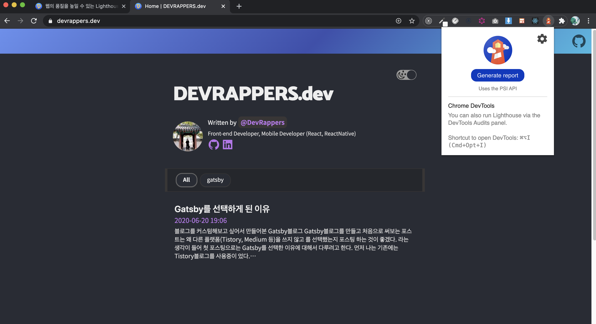
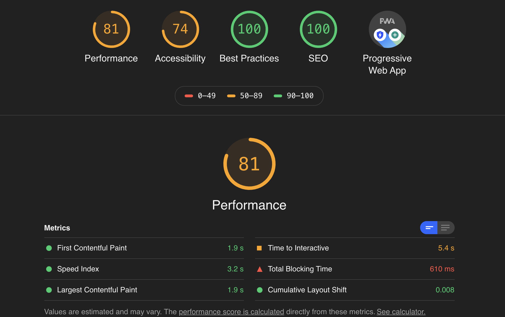
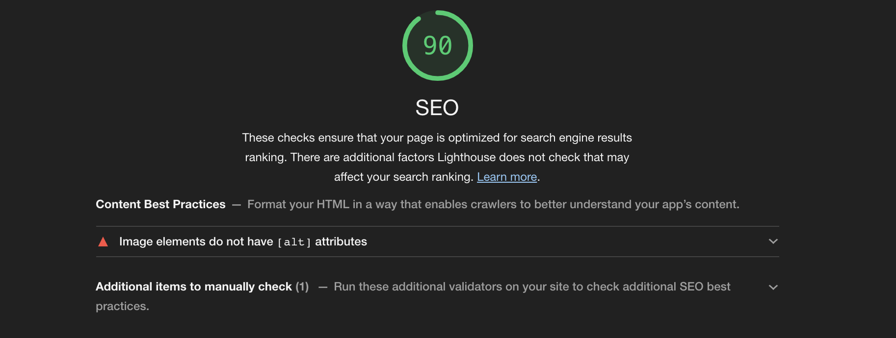

> 나의 웹사이트의 점수를 확인 할 수 있는 Lighthouse
>
> SEO를 최적화 시키는데 도움을 주는 Lighthouse

프론트엔드 개발자라면 꼭 신경을 써야 하는 것이 SEO(Search Engine Optimization)라고 생각한다.

`SEO`란 한마디로 웹사이트를 구글이나 네이버와 같은 검색엔진의 검색결과 상단에 노출시킬 수 있도록 최적화 하는 방법을 말한다.

우리말로는 "검색엔진최적화"라고 하며 프론트엔드 개발자가 항상 신경써야하는 부분 중에 하나이다.

SEO를 최적화시키는 방법에는 여러가지가 있지만 가장 기본 중에 기본은 HTML MarkUp을 잘하는 것이라고 생각한다.

## 그럼 내 웹사이트의 SEO 성능을 어떻게 알아?

SEO최적화에는 이 방법이 좋다 저 방법이 좋다 하지만, 구체적으로 어떻게 개발해야 하는지는 나와있지 않다.

구글문서에 따라 예시로 몇개를 말해보자면 title 태그를 위한 권장사항으로 페이지마다 고유한 title 태그를 작성하고 간결하면서 내용을 포함한 제목을 작성하고 이런 권장사항이 있으며,
description 메타 태그를 활용하여 페이지의 요약 정보를 보여주라는 등의 권장사항을 말해주고 있다. 

이러한 문서를 보고 처음부터 SEO를 생각하고 개발을 한다면 모두 행복한 개발을 진행하겠지만, 유지보수하고 개발하면서 SEO를 생각하는 경우가 대다수이기때문에 수많은 코드들 중에 어떤것이 SEO점수를 깎아 
먹고 있는지를 확인하기란 정말 어려운일이라고 생각한다.

## 그렇기 때문에 사용한다. Lighthouse 😗

요즘 회사에서도 그렇고 개인프로젝트나 팀프로젝트를 진행할 때 SEO최적화를 하려고 노력중인데 처음에 혼자서 코드를 수정하며 최대한 맞춰보려고 했지만 어떤 부분에서 SEO점수가 깎이고 있는
것인지 문득 궁금해졌다. 

그런 와중 `Lighthouse`를 발견하게 되었고 도움도 되는 것 같고, 나름 재밌고(?) 신기하여 이를 포스팅해보려고 한다.

## Lighthouse란?

Lighthouse란 웹 앱의 품지를 개선하는 오픈 소스 자동화 도구로 Lighthouse는 Chrome 확장 프로그램, 커맨드 라인, 노드 모듈에서 프로그램으로도 활용할 수 있다. 
Lighthouse에 확인 할 URL을 지정하고 페이지에 대한 테스트를 실행한 다음 페이지에 대한 보고서를 작성하게 된다. 

## Lighthouse 사용법 

프로젝트 안에서도 사용이 가능하지만 이번 포스트에서는 chrome을 통해 Lighthouse를 사용하는 방법에 대해서 다뤄보려고 한다. 

먼저 chrome을 열고 [Lighthouse](https://developers.google.com/web/tools/lighthouse/) 를 들어가서 확장프로그램에 추가시켜준다. 

이러면 사용할 준비는 끝난 것이다. 

내가 서버에 올려둔 웹사이트에서 Lighthouse를 사용하는 방법은 정말 간단한다 이런식으로 사용하면 된다.
지금 나의 블로그로 테스트를 해보겠다.

 

여기서 Generate report를 누르게 되면 보고서가 생성된다.

 

> 보고서가 작성된 것을 확인 할 수 있다.

이런식으로 보고서를 생성하게 되면 현재는 SEO점수가 100점이지만 SEO점수나 다른 점수가 낮을 경우는 어떤 것을 고치면 좋은지 컨펌해준다.

로컬에서 작업할 경우 위의 방식으로는 보고서를 생성할 수 없고, 개발자도구의 devtools를 이용하면 되는데 이런식으로 이용하면 된다. (다른 프로젝트로 테스트를 해보겠다.)

 

 

SEO 점수가 낮을 경우에는 이런식으로 컨펌해주는데 이를 보고 수정하면 된다.

 

 

보고서를 보면 이미지 태그에 alt를 달지 않은 것이 문제라고 알려준다. 이를 찾아 수정하면 SEO점수가 올라가게 된다.

### 마무리 

SEO 최적화는 초기부터 진행하는 것이 정말 좋다. 이런 좋은 툴을 사용해서 확인해가면서 고치는 것도 어지간히 힘든 일이다. 다들 미리미리 SEO 최적화 된 웹을 개발하여 구글 검색엔진을 괴롭혔으면 좋겠다. 😇
