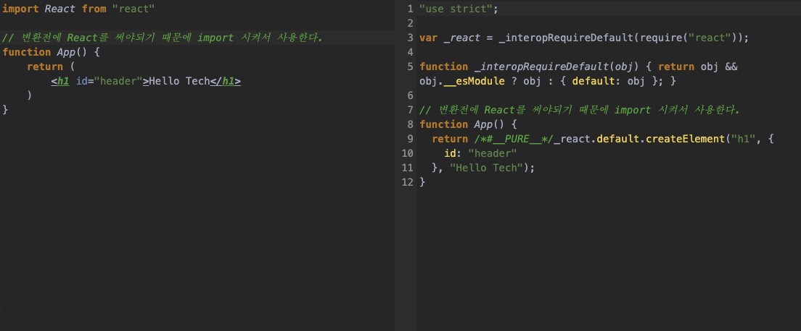

> 우아한 테크러닝 3기 React&TypeScript 1회차 

오늘은 어제 수강한 우아한 테크러닝 3기 React&TypeScript 1회차에 대한 정리를 해보려고 한다.

## 우아한 테크러닝 3기?
`우아한 테크러닝` 이란 우아한형제들에서 진행하고 있는 교육시스템 중 하나로 현재 현업 개발자를 대상으로 교육을 
진행하는 시스템이다. 나는 회사 사수님의 신청해보라고 추천하셔서 신청을 하게 되었고 교육생으로 선발되어 교육을 듣기 시작하였다.

작년에는 우아한형제들의 개발자외에 외부 개발자 50명을 선발해서 교육을 진행했다고 하는데 올해에는 온라인으로 진행해서
1200명 넘는 개발자들이 신청하였고 약 400명정도의 개발자가 참여한다고 한다. 오프라인으로 진행했으면 30명정도 선발했을 것이라 하는데... 
아마 붙는건 하늘의 별따기 였을 것 같다.. 😂

그래서 이왕 교육생으로 선발된 김에 어떤 내용을 배우게 되고 어떤 이야기를 진행했는지 블로그에 자세히 포스팅 하려고 한다.

## 교육의 목표 / 커리큘럼
먼저 강사님이신 우아한형제들의 기술이사 민태님이 강의시작 전 목표, 도구, 주로 다룰 키워드 등을 설명해 주셨다.

첫번째 강의목표는 <span style="color: red">"나는 잘하고 있나?"</span> 라는 질문에 대한 해답을 찾자였다.
현재 나도 저런 생각을 많이 하기 때문에 이 강의를 제대로 듣는다면 어느정도 해답을 얻을 수 있을 것 같았다.

두번째 강의 목표는 <span style="color: red">"개발자들간의 네트워킹을 형성하자"</span> 였고,

마지막 강의목표는 <span style="color: red">"코드품질, 아키텍처, 적정 기술에 대해서 배우자"</span> 였다.

이 강의목표와 더불어 주로 다룰 키워드로 상태, 환경, 제품, 목표, 코드, 상대적 이라는 키워드를 제시해 주셨다.
- 상태(state) : 어플리케이션의 상태를 어떻게 관리하고 다룰 것인가?
- 환경(Env) : 실행환경이 다양한테 환경적인 것을 어떻게 대응할 것인가? 개발환경에 대해서도?
- 제품(Product) : 개발을 하는 것 뿐 아니라 제품적인 측면으로 생각해볼 것
- 목표(Mission) : 많은 도구를 조합해 만드는 제품이 해결해야할 목표와 어떤 도구를 쓰더라도 각각의 도구가 원천적으로 목표하는 것을 이루도록 하는 것
- 코드(Code) : 코드의 퀄리티를 높일 수 있는 방법 
- 상대적(E=mc^2) : 위에 있는 모든 것은 사람들마다 다르기 때문에 상대적이다. 어떻게 적용하냐에 따라 다른 결과이기 때문.

<br/>

커리큘럼은 큰 항목으로 7개 정도 진행할 것 같았다.
1. [TypeScript](https://www.typescriptlang.org/play)
2. [React](https://reactjs.org/)
3. [Redux](https://redux.js.org/)
4. [redux-saga](https://redux-saga.js.org/)
5. [MobX](https://mobx.js.org/README.html)
6. [Blueprint.js(style)](https://blueprintjs.com/)
7. [Testing Library](https://testing-library.com/)

## TypeScript
첫번째 본 교육 내용으로 `TypeScript`를 진행했다. 

먼저 TypeScript의 대한 설명으로 TypeScript는 강타입 언어로 개발자의 실수를 사전에 방지할 수 있다고 말씀하셨다.
이러한 것과 더불어 "JavaScript에 prop-types같은 것만 사용하면 되지 TypeScript를 왜 써?" 라는 질문을 해결해주셨다.

### 타입추론을 통한 암시적 타입 지정
```typescript
let foo = 10;
```


### 명시적 타입 지정
```typescript
let foo:number = 10;
```

먼저 타입추론을 통한 암시적 타입 지정을 할 경우에는 foo라는 변수를 만들면서 TypeScript의 컴파일러가 10이 어떤 Type인지 알아내어(타입추론) foo 변수의
type을 number로 지정해준다.

명시적 타입 지정의 경우에는 변수를 선언하면서 number라는 타입을 지정해주었다.

이런식으로 타입이 지정되게 되면 foo라는 변수에는 number type의 값만 넣을 수 있게 된다. 즉 true, false같은 boolean형태의 값은 넣지 못하는 것이다.

<span style="color: red">"그럼 암시적, 명시적 중 어떤게 더 좋은 코드인가?"</span>

이는 코드를 짜는 사람의 마음도 있지만 코드의 트렌드에 따라서 바뀌었다고 한다. 예전에 내가 아마 코드를 안짜던
시절에는 암묵적이면서 길고 이런코드가 좋은 코드라고 인정을 받았다고 한다. 하지만 현재는 짧으면서 가독성이 높은 코드가 
좋은 코드라고 인정을 받기 때문에 현재는 명시적으로 타입을 지정해주는 것이 좋다고 한다.


### 타입 별칭 (TypeAlias)
그럼 type은 number, string같이 정해져있는 타입만 넣을 수 있을까? 전혀 아니다. 
```typescript
type Age = number;
    
let age:Age = 23;
```
이런식으로 타입별칭을 사용해 가독성을 높여주는 코드를 작성할 수 있다. 물론 Age와 number는 같은 타입이다.

### 객체 타입 
```typescript
type Age = number;

type People = {
  age: Age;
  name: string;
}

const me:People = {
  age: 23,
  name: "devrappers"
};
```
이런식으로 객체타입을 명시해줄 수 있으며 type의 이름을 지정하여 더욱 가독성이 좋은 코드를 짤 수 있다. 객체 타입을 정의 하는 방법에는
type말고 interface라는 것도 존재한다.

```typescript
type Age = number;

interface People{
  age: Age;
  name: string;
}

const me:People = {
  age: 23,
  name: "devrappers"
};
```

이런식으로 interface는 사용이 가능한데 둘이 매우 흡사하기 때문에 비슷한 방식으로 사용이 가능하다.

## React + TypeScript
다음으로는 `create-react-app`을 사용하여 typescript로 된 react프로젝트를 간단히 생성해보았다.

```shell script
npx create-react-app <app_name> --template typescript
```

이런식으로 간단히 생성이 가능하다. create-react-app을 사용하게 되면 간단히 프로젝트 생성이 가능하지만 여러 단점이 있다고한다.
1. CRA개발자들이 보수적이다.
2. 다양한 개발 환경에 대한 적용이 어렵다. (CRA는 local, prod밖에 지원을 하지 않는다.)
3. eject를 사용해서 뜯어 고칠 수 있지만 힘들다.

이런식으로 create-react-app에 대해서 설명해주시고 간단한 컴포넌트를 개발해보았다.

```typescript
// index.tsx
import React from "react";
import ReactDom from "react-dom";

function App() {
    return (
        <h1>Tech Hello!</h1>
    );
}

ReactDom.render(
    <React.StricMode>
        <App/>
    </React.StrictMode>,
    document.getElementById("root")
)
```

ReactDom의 render함수는 가상돔에 컴포넌트를 그리는 함수이며 두개의 인자값을 받는다. 첫번째는 렌더링될 컴포넌트 두번째는 이 컴포넌트를 넣은 HTML요소를 넣어준다.

이런식으로 설명을 해주시고 리액트를 처음배우는 사람들을 위해 babel를 트랜스파일러를 통한 변환 전과 후의 컴포넌트를 보았다.



### App 컴포넌트의 props를 주기 
```typescript
import React from "react";
import ReactDOM from "react-dom";

interface AppProps {
  title: string;
  color: string;
}

function App(props: AppProps) {
  return <h1 style={{ color: props.color }}>{props.title}</h1>;
}

ReactDOM.render(
  <React.StrictMode>
    <App title="Tech Hello?" color="red" />
  </React.StrictMode>,
  document.getElementById("root")
);
```

React에서는 외부에서 가지고 있는 값을 필요로 하는 경우에 props로 값을 넘겨준다. 
이 경우에는 title, color가 객체 형태로 넘어가게 되고 JavaScript에서는 prop-types를 적거나 적지 않아도 작동하지만 TypeScript는 
컴파일에러를 출력해준다. 이는 props의 타입이 지정되지 않았기에 생기는 문제이며 이를 interface를 통해 해결해주었다.

### 전역적인 상태관리 (Redux, MobX)
마지막으로 Redux와 MobX에 대한 간단한 설명을 해주셨다. 

`Redux`란 매우 간단한 전역적 상태관리 도구이 `MobX`는 전역적 상태관리를 편하게 할 수 있는 도구라고 설명해주셨다.
이에 대해서 Redux는 간단하기 때문에 복잡한 것을 하려면 많은 것이 필요하다고 설명해주셨고, MobX같은 경우에는 기능이 많아서 다양하게 사용가능하지만 
기능이 많기 때문에 실수할 여지가 있다고 설명해주셨다. 기능이 적은 경우 개발자에게 이렇게 해라 라고 가이드를 줄 수 있지만, 기능이 많은 경우에는 이렇게 해라! 라고 가이드를
주기 힘들다고 말씀해주셨다.

첫번째 시간에는 이렇게 상태관리 라이브러리를 되게 간단히 알아보았다.

## 마무리 🚀 
2시간 30분이라는 시간동안 강의를 들었지만 물론 다 아는 내용이긴 해도 좋은 말도 많이 듣고 뜻깊은 시간이었던 것 같다.

민태님이 하신 말씀중에 주니어는 시니어와 비교했을 때 유리한 부분으로 압도적으로 시간이 많다고 하시며, 그 시간에 여유를 가지고 공부하는게 좋다고 말씀하셨다.
초초한 생각을 가지지 말고, 증명하려고 공부하지말고 마라톤이라고 생각하고 여유를 가지면서 공부를 하면 좋은 시니어 개발자가 될 수 있다고 말씀해주신 것이 어제 강의중에 가장 기억에 남은 것 같다.

앞으로 7회차 정도의 강의를 듣겠지만 더 많이 배우고 더 열심히 해야겠다는 생각이 든다.


 


